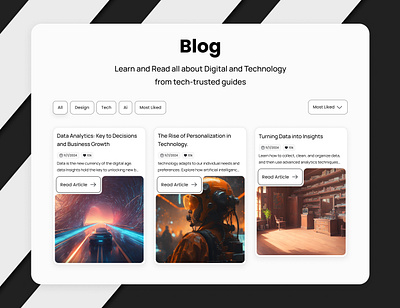
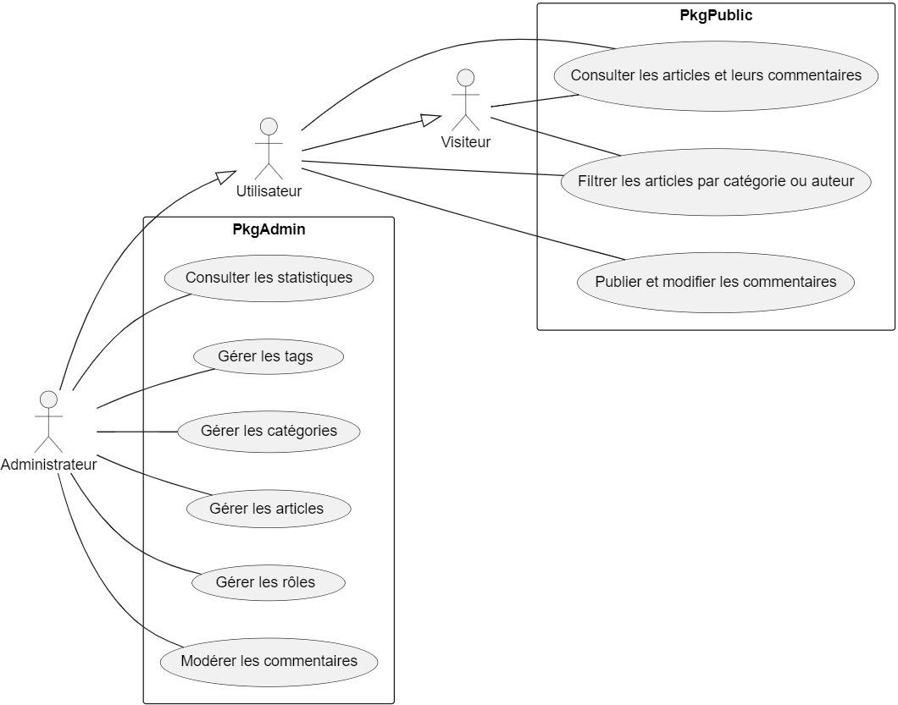
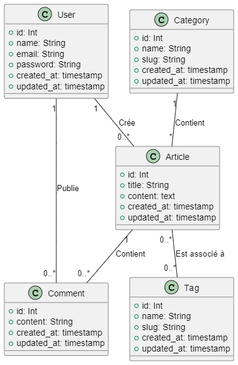

>## Projet Blog

- **Réalisé par** :
  - Zakaria Azizi  
  - TAMRAOUI Abdelouahab  
  - AMAZU Ayoub  
  - BOUSSAKALA Yahya  
- **Encadré par** : ESSARRAJ Fouad  

|||

### **1. Introduction**

|||
### **2. Methodologie de travail :**

|||

### **3. Planification :**

<table style="font-size: 29px" >
  <tr>
    <th></th>
    <th>1</th>
    <th>2</th>
    <th>3</th>
  </tr>
  <tr>
    <td>Lundi</td>
    <td>Tutoriels</td>
    <td>Planification</td>
    <td>Prototype</td>
  </tr>
  <tr>
    <td>Mardi</td>
    <td>-</td>
    <td>-</td>
    <td>Cas d'utilisation & Installation</td>
  </tr>
  <tr>
    <td>Mercredi</td>
    <td colspan="3" style="text-align: center; ">Réalisation</td>
  </tr>
  <tr>
    <td>Jeudi</td>
    <td colspan="3" style="text-align: center; ">Réalisation</td>
  </tr>
  <tr>
    <td>Vendredi</td>
    <td colspan="2" style="text-align: center; ">Réalisation</td>
    <td>Présentation</td>
  </tr>
</table>

|||
### **5. Apprentissage :**
- Laravel ui
- Security spatie

|||

### **5. Prototype :**
  
- visualiser les Categories  
- ajouter un Categorie  
- supprimer un Categorie  

|||

### **6. Cas d'utilisation :**

|||

### **7. Diagramme des classes :**

|||

### **8. Réalisation :**

|||

### **9. Conclusion :**  
> Merci pour votre attention